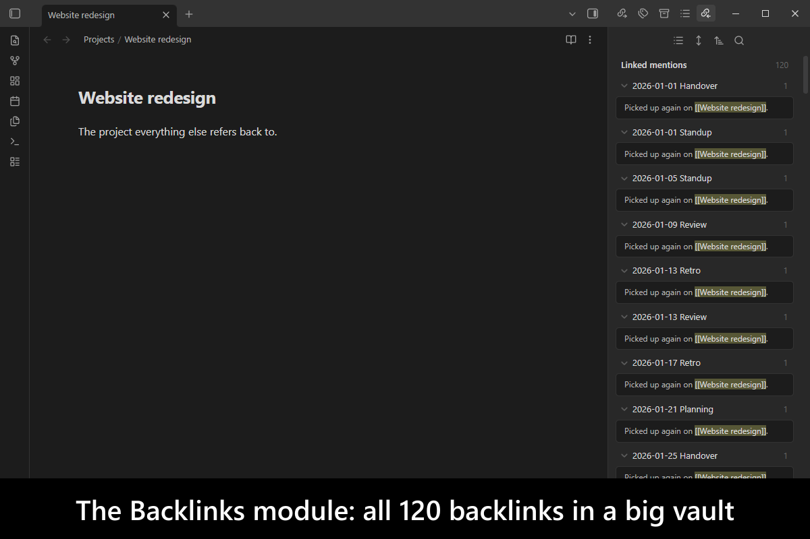
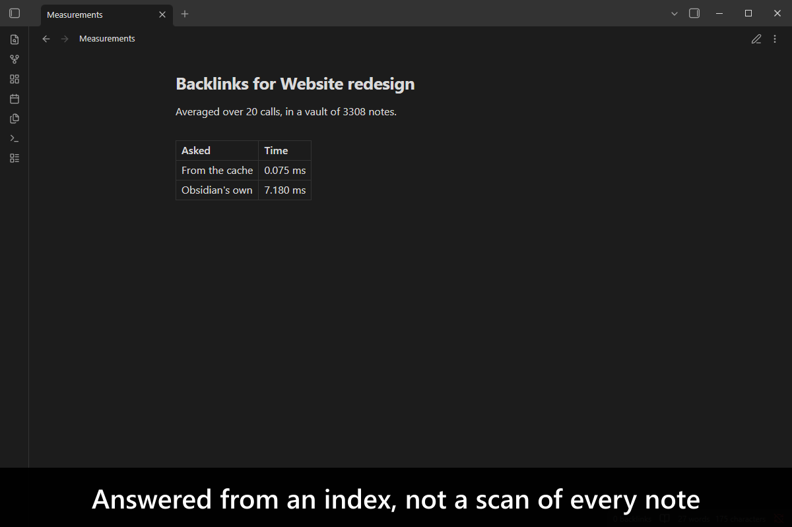
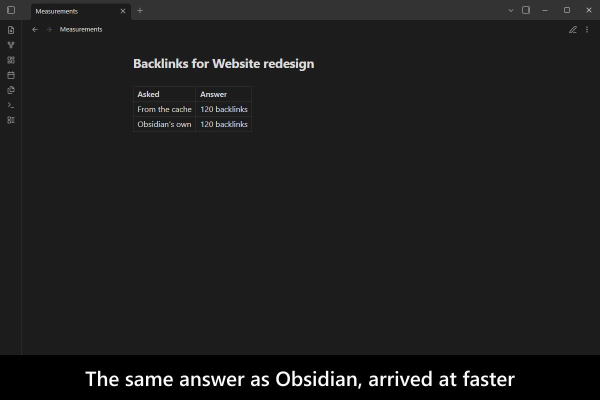
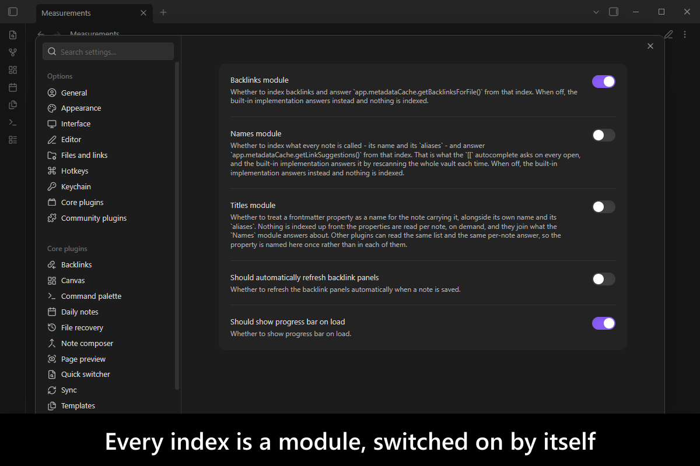
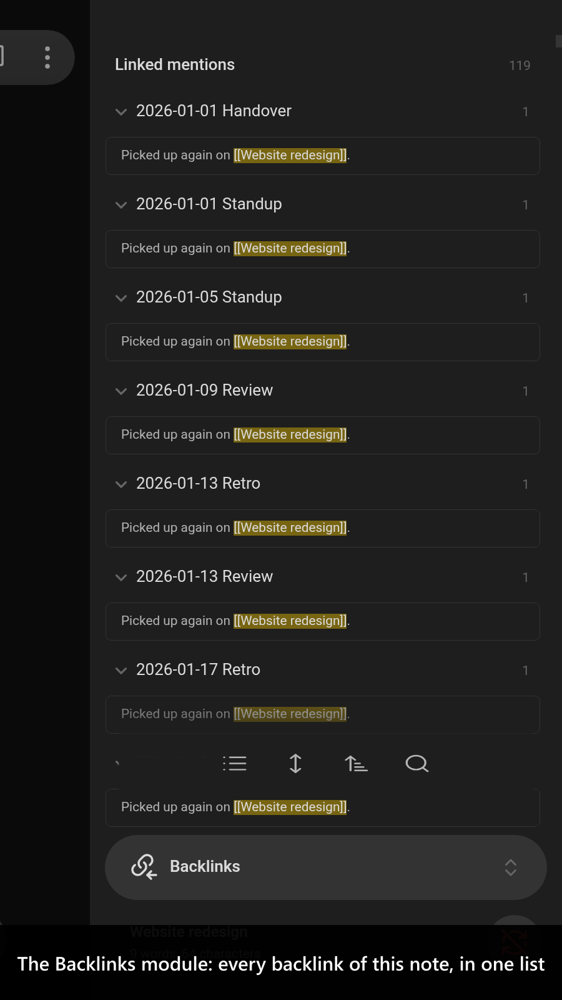
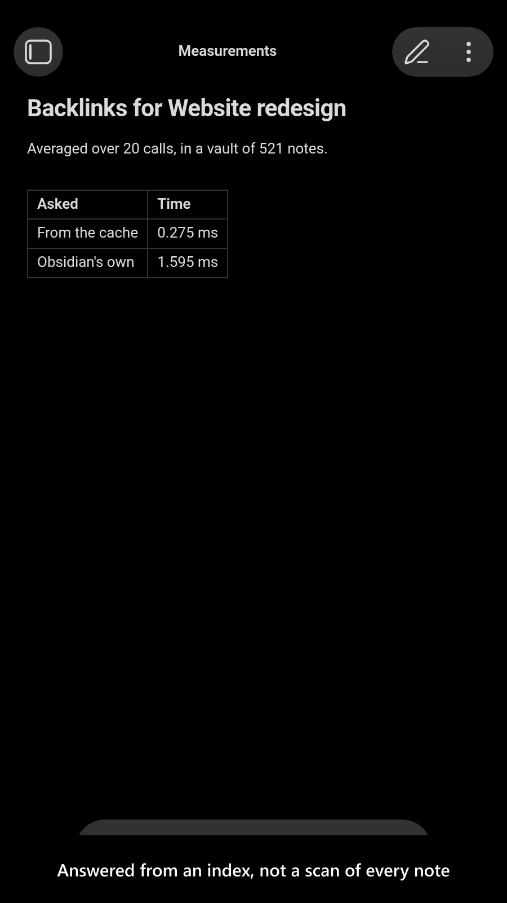
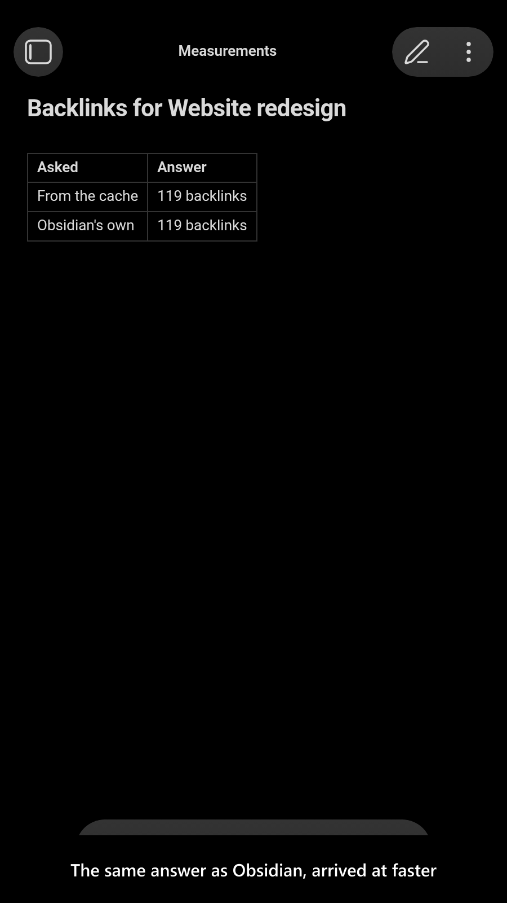
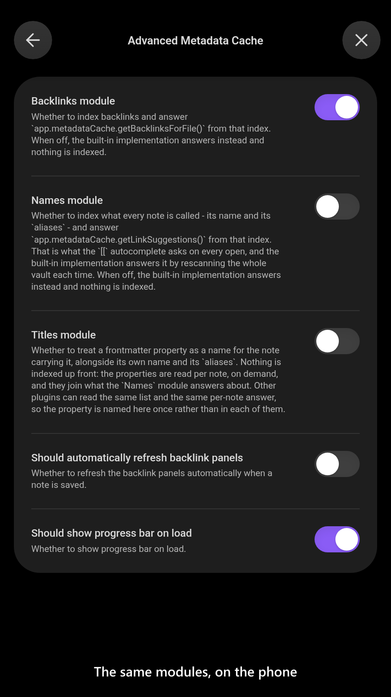

# Advanced Metadata Cache

[](https://www.buymeacoffee.com/mnaoumov) [](https://github.com/mnaoumov/obsidian-advanced-metadata-cache/releases) [](https://github.com/mnaoumov/obsidian-advanced-metadata-cache/releases) [](https://github.com/mnaoumov/obsidian-advanced-metadata-cache)

Some of the questions [Obsidian](https://obsidian.md/) answers about a vault have no index behind them. Asking which notes link to this one means scanning every note, on every call — the Backlinks pane pays that cost, and so does every plugin that asks the same question. Asking what every note is called means the same walk, and the `[[` autocomplete pays it every single time you open it. On a large vault it is slow enough to be felt.

This plugin maintains the indexes those questions deserve and answers from them instead. It does so by replacing the method that already asks the question, so nothing has to know the plugin is installed: the Backlinks pane gets faster, and so does anything else that asks.

Each index is a **module** that is switched on or off on its own, so a vault only pays for the ones it uses. On a small vault you will not notice any of them; that is the point at which you do not need this.

<!-- markdownlint-disable MD033 -->

<a href="https://github.com/mnaoumov/obsidian-advanced-metadata-cache/blob/HEAD/images/screenshots/screenshot-desktop-1.png"></a>

<details>
<summary>More screenshots</summary>

<div>
<a href="https://github.com/mnaoumov/obsidian-advanced-metadata-cache/blob/HEAD/images/screenshots/screenshot-desktop-2.png"></a>
<a href="https://github.com/mnaoumov/obsidian-advanced-metadata-cache/blob/HEAD/images/screenshots/screenshot-desktop-3.png"></a>
<a href="https://github.com/mnaoumov/obsidian-advanced-metadata-cache/blob/HEAD/images/screenshots/screenshot-desktop-4.png"></a>
<a href="https://github.com/mnaoumov/obsidian-advanced-metadata-cache/blob/HEAD/images/screenshots/screenshot-mobile-1.png"></a>
<a href="https://github.com/mnaoumov/obsidian-advanced-metadata-cache/blob/HEAD/images/screenshots/screenshot-mobile-2.png"></a>
<a href="https://github.com/mnaoumov/obsidian-advanced-metadata-cache/blob/HEAD/images/screenshots/screenshot-mobile-3.png"></a>
<a href="https://github.com/mnaoumov/obsidian-advanced-metadata-cache/blob/HEAD/images/screenshots/screenshot-mobile-4.png"></a>
</div>

</details>

<!-- markdownlint-enable MD033 -->

## Demo vault

**The documentation is an interactive demo vault.** Every feature has a note that explains what it does and why you would want it, with buttons that measure the difference for real.

**[Start reading here](<./demo-vault/00 Start.md>)** — it is plain markdown, so it works on GitHub with nothing installed.

A copy of the vault ships with every release. You can access it via any of the following:

1. Running the **Advanced Metadata Cache: Open demo vault** command.
2. Downloading `advanced-metadata-cache-demo-vault.zip` from the [Releases](https://github.com/mnaoumov/obsidian-advanced-metadata-cache/releases). It unzips into a single `advanced-metadata-cache-demo-vault-<version>` folder.
3. Browsing its source in [`demo-vault/`](./demo-vault/README.md) in this repository.

## What it does

- **A backlink index that keeps itself current**, so the Backlinks pane and every plugin that asks for backlinks stop rescanning the vault. [01 Backlink cache](<./demo-vault/01 Backlink cache.md>)
- **Three ways to ask** — fast from the cache, safe after pending changes settle, or the original built-in implementation for comparison. [02 Fast, safe, and original backlinks](<./demo-vault/02 Fast, safe, and original backlinks.md>)
- **Canvas files are indexed too**, and their links are exposed through `getCache()`, which is otherwise left empty for canvas files. [03 Canvas backlinks](<./demo-vault/03 Canvas backlinks.md>)
- **Frontmatter markdown links count as backlinks** when the [`Frontmatter Markdown Links`](https://community.obsidian.md/plugins/frontmatter-markdown-links) plugin is installed. [03 Canvas backlinks](<./demo-vault/03 Canvas backlinks.md>)
- **A name index behind the `[[` autocomplete**, so opening it stops rescanning every note in the vault for its name and aliases. [05 Name index](<./demo-vault/05 Name index.md>)
- **A frontmatter property can name a note too**, so a note titled in its `title` property is found under that title — and, if you ask for it, offered under that title by the `[[` autocomplete. [06 Titles](<./demo-vault/06 Titles.md>)
- **Every index is a module of its own**, switched on or off without touching the others, and refresh behavior is configurable. [04 Settings](<./demo-vault/04 Settings.md>)

## Modules

| Module    | What it indexes                                                                           | Default |
|-----------|-------------------------------------------------------------------------------------------|---------|
| Backlinks | Which notes link to a note, answering `getBacklinksForFile()`.                            | On      |
| Names     | What each note is called - its name and its `aliases` - answering `getLinkSuggestions()`. | Off     |
| Titles    | What a note's own frontmatter says it is called, read per note and on demand.             | Off     |

Switching a module off unloads it completely — its index, its listeners and the commands it registers all go with it, and the built-in implementation answers again. Switching one back on rebuilds its index from scratch.

### Titles

A note can carry its real name in a frontmatter property rather than in its filename — `title` is the usual one, and several plugins write it. Obsidian itself does not treat that value as a name, so nothing can find the note by it.

Switch the **Titles** module on and every property you list there is read as a name. The list defaults to `title` alone, and it joins the note's own name and its `aliases`:

```yaml
---
title: The Real Name
---
```

Two things then know about it. `getPathsByName('The Real Name')` finds the note, while the **Names** module is on — and any other plugin can read the same properties and the same per-note answer, so you name the property here once instead of once per plugin.

**It does not change the `[[` autocomplete unless you ask it to.** Out of the box the list Obsidian offers there is answered faster by this plugin, not differently, so nothing about typing a link moves. Switch **Offer titles in the `[[` autocomplete** on — it appears under **Settings** once both the **Names** and **Titles** modules are on — and every title is offered there too, appended after everything Obsidian itself would have offered rather than ranked against it. Accepting one writes a link like:

```markdown
[[Notes/some-note|The Real Name]]
```

which resolves through Obsidian's own machinery, survives a rename, and keeps working if you ever switch this plugin off. A title that already matches the note's own name or one of its `aliases` is not offered a second time.

This is the reverse direction from [Front Matter Title](https://github.com/snezhig/obsidian-front-matter-title), and the two are independent by design: that plugin takes a note and shows you its title, in the explorer, the tabs and the graph. This one takes a title and finds you the note. If you run both, name the property in each — one setting silently changing what another plugin answers would be worse than typing it twice.

## For plugin developers

Everything this plugin offers another plugin is declared in one hand-written file — [api.d.ts](./api.d.ts) at the repository root. It imports from `obsidian` and nothing else, so you can copy it into your own code or reference it where it sits, with no build-time dependency on this repository.

There are two kinds of surface in it, and which one you use depends on the module.

### The widened core calls

This plugin replaces `app.metadataCache.getBacklinksForFile()` with a faster implementation, adds an overload accepting a vault `path` as well as a `TFile`, and keeps the original reachable:

```js
const fast = app.metadataCache.getBacklinksForFile(pathOrFile);
const safe = await app.metadataCache.getBacklinksForFile.safe(pathOrFile);
const original = app.metadataCache.getBacklinksForFile.originalFn(file);
```

All three members arrived in 1.0.0, and all three are present only while the **Backlinks** module is on — a consumer that cannot assume it is should fall back to the built-in signature rather than assume the widened one.

While the **Names** module is on, `app.metadataCache.getLinkSuggestions()` is answered from the name index instead of from a full vault walk, and carries the same three members plus the reverse lookup that walk cannot do at all:

```js
const fast = app.metadataCache.getLinkSuggestions();
const safe = await app.metadataCache.getLinkSuggestions.safe();
const original = app.metadataCache.getLinkSuggestions.originalFn();

const paths = app.metadataCache.getLinkSuggestions.getPathsByName('Some Alias');
const safePaths = await app.metadataCache.getLinkSuggestions.getPathsByNameSafe('Some Alias');
```

`getPathsByName` answers "which notes are called this?" — matching a note's own name or any of its `aliases`, case-insensitively and with runs of whitespace collapsed, exactly as Obsidian resolves a wikilink. The answer is a **list** and is deliberately unranked: several notes may declare the same alias, and which one the user meant is a question about your context, not about the vault.

All five of those members arrived in 1.0.0 as well, and like the backlink ones they are present only while their module — **Names** — is on.

**The array `getLinkSuggestions()` answers with is Obsidian's own, entry for entry** — `originalFn()` is there so you can check. The single exception is the **Offer titles in the `[[` autocomplete** setting described under [Titles](#titles): with it on, the title entries are *appended*, so Obsidian's array stays a strict prefix of what you get and the difference is exactly a suffix. It is off by default, so a consumer that has not been told otherwise can treat the two as identical.

**Use the `safe` variants when you may be asked early.** The patch is installed as soon as the module loads, but the index is built once the metadata cache can answer; until then a plain call falls through to Obsidian's implementation and `getPathsByName` answers with nothing. `safe()` / `getPathsByNameSafe()` wait for the build.

Both calls are typed in [api.d.ts](./api.d.ts) as `GetBacklinksForFileFn` and `GetLinkSuggestionsFn` — cast the core method to one of those to reach the added members. There is nothing to fetch and no version to negotiate: the patch is installed or it is not, so pin against the plugin version a member arrived in. [02 Fast, safe, and original backlinks](<./demo-vault/02 Fast, safe, and original backlinks.md>) runs all three backlink calls side by side, and [05 Name index](<./demo-vault/05 Name index.md>) does the same for the name calls.

### The Titles API

The two modules above answer by replacing a method Obsidian already has, so there is nothing to fetch. The **Titles** module has no such method to replace — Obsidian has no notion of a name-bearing property — so it publishes an API instead, `AdvancedMetadataCacheApi` in the same [api.d.ts](./api.d.ts):

```ts
import { watchPluginApi } from 'obsidian-dev-utils/obsidian/plugin/plugin-api';

const apiRef = watchPluginApi<AdvancedMetadataCacheApi>({
  apiVersionRange: '^1',
  app: this.app,
  component: this,
  pluginId: 'advanced-metadata-cache'
});

// `value` is always current and never stale: `null` while this plugin is not loaded, and non-`null`
// on its own once it is.
const api = apiRef.value;
if (api) {
  console.log(api.getTitlePropertyNames()); // ['title']
  console.log(api.getTitles('Notes/Some note.md')); // ['The Real Name']
}
```

Both arrived in contract `1.0.0`, and the contract version moves independently of the plugin's own, so ask for a range. Both answer **empty while the Titles module is off**, which is the same answer as "no property is configured" and is meant to be.

`getTitles` is synchronous and lazily memoized per note, so it is safe on a per-keystroke path. Read `getTitlePropertyNames()` and show that list rather than offering a property setting of your own — one place to type `title` is the point of the setting living here.

If you would rather not depend on `obsidian-dev-utils` for the handle, the registry is a documented wire protocol you can read directly — see [Cross-plugin APIs](https://mnaoumov.dev/obsidian-dev-utils/guides/cross-plugin-apis/).

## Installation

The plugin is not yet listed in [the official Community Plugins repository](https://community.obsidian.md/plugins). Until it is, install it as a beta release.

### Beta versions

To install the latest beta release of this plugin (regardless if it is available in [the official Community Plugins repository](https://community.obsidian.md) or not), follow these steps:

1. Ensure you have the [BRAT plugin](https://community.obsidian.md/plugins/obsidian42-brat) installed and enabled.
2. Click [Install via BRAT](https://intradeus.github.io/http-protocol-redirector?r=obsidian://brat?plugin=https://github.com/mnaoumov/obsidian-advanced-metadata-cache).
3. An Obsidian pop-up window should appear. In the window, click the `Add plugin` button once and wait a few seconds for the plugin to install.

## Debugging

By default, debug messages for this plugin are hidden.

To show them, run the following command in the `DevTools Console`:

```js
window.DEBUG.enable('advanced-metadata-cache');
```

For more details, refer to the [documentation](https://mnaoumov.dev/obsidian-dev-utils/guides/debugging/).

## Contributing

Contributions are welcome — see [CONTRIBUTING](./CONTRIBUTING.md) to get set up.

## Support

<!-- markdownlint-disable MD033 -->

<a href="https://www.buymeacoffee.com/mnaoumov" target="_blank"></a>

<!-- markdownlint-enable MD033 -->

## My other Obsidian resources

[See my other Obsidian resources](https://github.com/mnaoumov/obsidian-resources).

## License

© [Michael Naumov](https://github.com/mnaoumov/)
